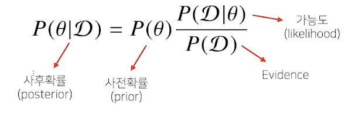
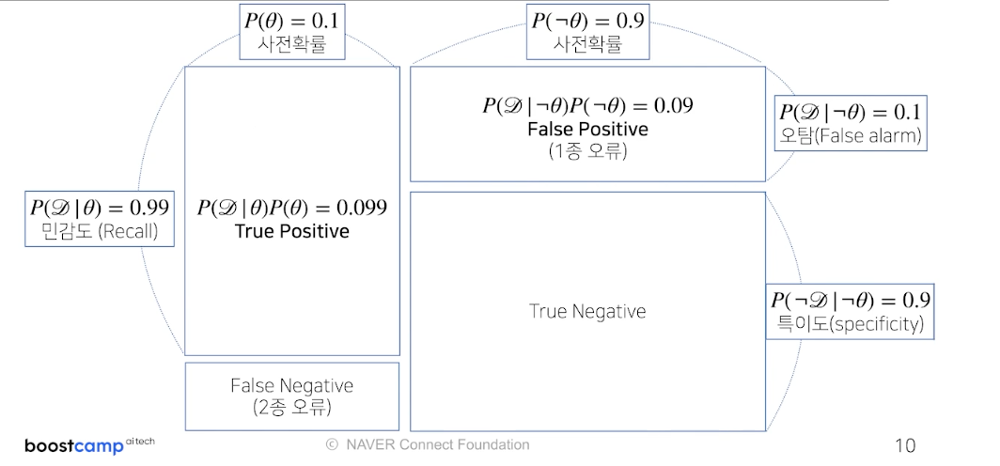
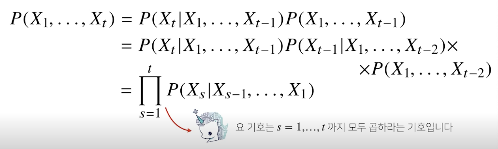
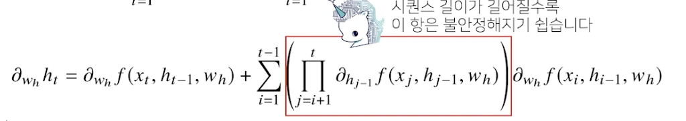

# (AI Math 7강) 통계학 맛보기
- 모수 : 평균과 분산
- 모수적 방법론
    - 특정 확률분포를 따른다고 선험적으로 가정 + 분포 결정하는 모수 추정하는 방법
- 비모수적 방법론(ML에 많이 활용)
    - 특정 확률분포 가정x + 데이터에 따라 모델의 구조 및 모수의 개수 유연하게 변화함
    - 모수는 무한히 많거나 데이터에 따라 변함 > 없는 것이 아님
- 확률분포 가정하기 : 데이터를 생성하는 원리를 먼저 고려해야함
- 표본분산 : 불편추정량을 구하기 위해서 (N - 1)로 나눔
- **표집분포 vs 표본분포**
    - 표집분포(sampling distribution) : 통계량(표본평균과 표분분산)의 확률분포
    - 표본분포(sample distribution) : 표본들의 분포
- 표본평균의 표집분포 > 중심극한정리 : N이 커질수록 정규분포를 따름, 모집단의 분포와 무관하게 성립
- **최대가능도 추정법(MLE) : 가장 가능성이 높은 모수를 추정하는 방법**
    - 가능도함수 : **데이터가 주어져있는 상황**에서 모수 $\theta$를 따르는 분포가 x를 관찰할 가능성 != 확률은 아니다.
    - 로그가능도(Log Likelihood)
        - 데이터의 숫자가 수억 단위 > 가능도 계산 불가능
        - 최적화관점에서 중요함
        - 연산량 : $O(n^2) -> O(n)$
    -MLE는 분산의 불편추정량 보장하지 않음(n으로 나눔)
- 카테고리분포(이산확률분포)
    - 베르누이 분포(이항분포)을 확장
    - 제약식 : $p_1+ ....... + p_d $=1 & 라그랑주 승수법 : 최적화 문제 해결

- 확률 분포 사이의 거리 
    - 총변동거리
    - **쿨백-라이블러 발산**
        - KL = entropy - cross_entropy
        - 분류문제에서 정답레이블P, 모델예측을 Q라 두면 **최대가능도추정법은 쿨백-라이블러 발산을 최소화**하는 것과 동일
    - 바슈타인 거리

💡KL-Divergence 특징
1) 항상 0이상의 값을 갖는다. KL(p∣q)≥0
2) 비대칭이다. $KL(p∣q) 
 =KL(q∣p) => KL-divergence$는 거리개념이 아니다
만약 두 확률분포 사이의 거리라면 p에서 q사이의 거리나 그 반대의 경우가 같아야 하지만 KL-divergence는 그렇지 않다.
3) 두 확률분포가 동일할 때 KL-Divergence의 값이 0이 된다.
---
# (AI Math 8강) 베이즈 통계학 맛보기
- **사전확률** 필수

- 예제
    - 사전확률 : $P(\theta)$, 코로나 발병률(알려짐) : 10%
    - **민감도** : 가능도 : $P(D|\theta)$, 실제로 걸렸을 때 검진될 확률 : 99%
    - **오탐** : 가능도 : $P(D|-\theta)$실제 걸리지 않았을 때 오검진될 확률 : 1%
    - 사후확률 : $P(\theta|D)$, 양성 검진이 나왔을 때 정말로 감염되었을 확률
    - evidence : $P(D) = P(\theta)P(D|\theta) + P(-\theta)P(D|-\theta) = P(\theta,D) + P(-\theta,D)$
    - 사후확률 : $P(\theta|D) = P(\theta) P(D|\theta) / P(D)$
- 조건부확률의 시각화

- 2종 종류 해결이 중요
- 정보의 갱신
    - 베이즈 정리릍 통해 새로운 데이터가 들어왔을 때 **앞서 계산한 사후확률을 사전확률로 사용하여** *갱신된 사후확률*을 계산
- 조건부확률이 인과관계를 추론해서는 안된다.
    - 인과관계 : 데이터분포의 변화에 강건한 예측모형을 만들 때 필요(단, 인과관계'만' - 높은 예측도 담보 불가)
    - 인과관계를 알기 위해서는 **중첩요인의 효과 제거** >>> 가짜 연관성을 얻기도 함
---
# (AI Math 9강) CNN 첫걸음
---
# (AI Math 10강) RNN 첫걸음
- 시퀀스 데이터 
    - 소리, 문자열, 주가, 시계열 데이터 등의 데이터(이벤트 발생 순서 중요!) 
    - 독립동등분포 가정 잘 위배 > 순서를 바꾸거나 과거 정보에 손실 발생 > 데이터 확률분포도 바뀌게 됨
    - 이전 시퀀스 정보를 갖고 앞으로 발생할 데이터의 확률분포를 다루기 위해 조건부확률 & 베이즈 법칙 사용
    
    - 과거의 모든 정보를 사용하지는 않음.
    - 가변적인 데이터를 다룰 수 있는 모델이 필요.
- 예측모델
    - AR(자기회귀모델) : 고정된 길이 $\tau$만큼의 시퀀스,정보 활용
    - 잠재자기회귀모델: 바로 이전 정보를 제외한 나머지 정보들을 $H_t$라는 잠재변수 설정, 가변적 데이터 문제를 고정된 데이터로 변화 
- **RNN**
    - 가중치 행렬 3개 : t에 영향을 받지 아니함
        - $W_X(1), W_H(1), W(2)$
    - $H_t$가 t에 영향을 받는 변수들
    -BPTT(역전파) : 시퀀스 길이가 길어질수록 불안해지는 항 > 기울기소실 발생함
        
- **기울기 소실 해결책**
    - trucated BPTT : 길이를 끊어서 그레디언드틀 나눠서 전달함
    - GRU
    - LSTM
